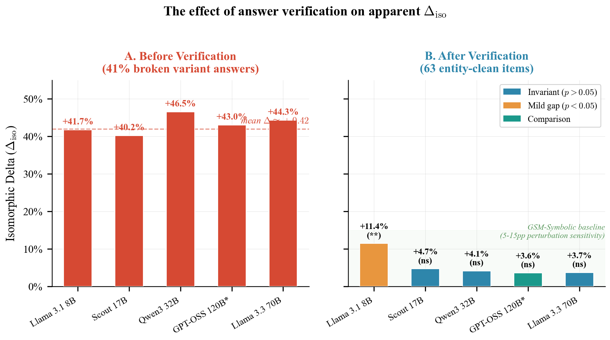
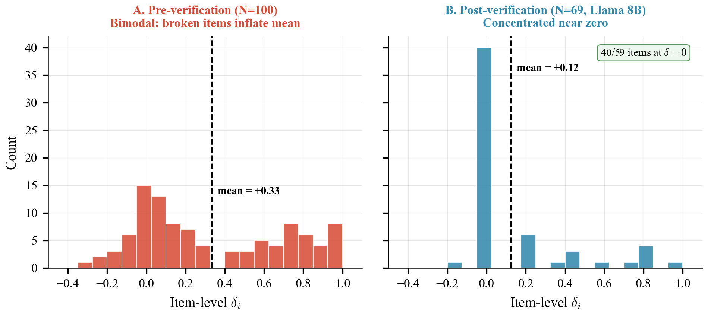

<div align="center">

# Isomorph-Eval

### Structurally Equivalent Benchmarks Reveal That<br>Annotation-Chain Replay Produces False Contamination Signals

**A framework for generating verified benchmark variants via tau-isomorphism**

[](https://arxiv.org/abs/2606.XXXXX)
[-blue.svg)](https://arxiv.org/abs/2605.11205)
[](LICENSE)
[](https://www.python.org/)
[]()

[Paper](#the-science) •
[The Cautionary Finding](#the-cautionary-finding) •
[How It Works](#how-it-works) •
[Results](#results) •
[Quickstart](#quickstart) •
[Citation](#citation)

</div>

---

## The Cautionary Finding

We built a framework to detect benchmark contamination. Instead, we discovered that **the standard method for computing variant answers produces systematically wrong answers in 41% of items** — creating false contamination signals that are indistinguishable from genuine memorization.

| | Before Verification | After Verification |
|---|---|---|
| **Apparent signal** | All 5 models show Delta ~ +0.42 | 4/5 invariant, 1/5 mild gap (Delta 0.04-0.11) |
| **Interpretation** | "Universal contamination" | Perturbation sensitivity, not contamination |
| **Comparison model** | GPT-OSS 120B also appeared "contaminated" | GPT-OSS 120B invariant (p = 0.090) |
| **Root cause** | 41 of 100 items had wrong variant answers | Verified answers plus entity consistency audit |

The lesson: **any benchmark variant generation pipeline must independently verify its answers**. Annotation-chain replay — substituting new values into the original solution chain — is unreliable.

### Eight Bug Classes

We identified eight distinct failure modes in annotation-chain replay and entity substitution:

1. **Value conflation** — Same numeric value serves multiple semantic roles; mutation changes both uses in the graph but only one in the text
2. **Phantom leaf values** — Solution chain introduces intermediate results as leaf nodes not present in the question
3. **Positional replacement collisions** — Sequential text replacement causes new values to shadow old values of other nodes
4. **Magnitude inflation** — Same-digit-class sampling produces systematically larger variant answers
5. **Answer invariance** — Some graph structures produce the same answer regardless of leaf mutations
6. **Partial name replacement** — Word-boundary-unaware replacement causes "Beth" to match inside "Bethany"
7. **Node reuse** — Safety fallback promotes values appearing multiple times, reintroducing conflation
8. **Inconsistent entity replacement** — Word-boundary-unaware replacement produces artifacts such as "Tommy" -> "Zaramy" and leaves original names behind

---

## The Science

### tau-Isomorphism

We formalize structural equivalence as **tau-isomorphism**: two benchmark items are tau-isomorphic if there exists a graph isomorphism between their reasoning graphs that preserves operation types, dependency structure, and complexity weights. Unlike semantic similarity heuristics, tau-isomorphism is a deterministic, verifiable structural condition.

### The Isomorphic Engine

A four-stage pipeline that produces verified tau-isomorphic variants:

```
Parser  -->  Mutator  -->  Generator  -->  Verifier
S -> G,V     G -> G'       G' -> S'        S' -> G'' ≅ G'
```

**Parser**: Decomposes a benchmark item into its reasoning graph and verification function.
**Mutator**: Swaps entities and values while locking graph topology and operation types. Forward-executes the graph to compute answers automatically.
**Generator**: Produces fluent text from the mutated graph.
**Verifier**: Re-parses output and compares structural fingerprints. Rejects corrupted items.

### Connection to EFSL

In prior work ([EFSL](https://arxiv.org/abs/2605.11205)), we showed that evaluation accuracy degrades as a function of data sparsity (S) and item difficulty heterogeneity (D). Contamination (C) represents a third axis: `1 - rho = f(S, D, C)`. IRT on verified isomorphic data addresses all three axes simultaneously.

---

## The Metric: Delta_iso

```
Delta_iso^IRT(M, B) = (1/N) Sum_i a_i * [P(X_i=1) - P(X_i'=1)]
```

Weighted by IRT item discrimination `a_i`. Grounded in the psychometric Differential Item Functioning (DIF) framework. A positive delta may indicate memorization *or* perturbation sensitivity; comparison models and disclosed training-data provenance help disambiguate.

### Diagnostic Archetypes

| Archetype | Delta_iso | Interpretation |
|-----------|-----------|----------------|
| **Invariant** | Not significant (p > 0.05) | Robust reasoning transfer to novel variants |
| **Mild Gap** | Significant, Delta < 0.15 | Perturbation sensitivity or mild memorization |
| **Partial Memorizer** | Significant, 0.15-0.30 | Mix of reasoning and recall (theoretical) |
| **Pure Memorizer** | Significant, Delta > 0.30 | Performance collapses on isomorphs (theoretical) |

---

## Results

### Entity-Clean Verified Results (N=63)

| Model | N | Acc_orig | Acc_iso | Delta_iso [95% CI] | p | Archetype |
|-------|---|----------|---------|-------------------|---|-----------|
| Llama 3.1 8B | 63 | 95.2% | 83.8% | +0.114 [+0.043, +0.183] | 0.003** | Mild |
| Llama 4 Scout 17B | 63 | 93.7% | 89.0% | +0.047 [-0.012, +0.108] | 0.106 | Inv |
| Qwen3 32B | 43 | 100.0% | 95.9% | +0.041 [+0.000, +0.103] | 0.054 | Inv |
| GPT-OSS 120B* | 18 | 100.0% | 96.4% | +0.036 [+0.000, +0.089] | 0.090 | Inv |
| Llama 3.3 70B | 12 | 100.0% | 96.3% | +0.037 [+0.000, +0.100] | 0.500 | Inv |

*GPT-OSS 120B serves as a comparison model; its training data composition is not fully disclosed.

Four of five models show no significant performance gap between originals and variants. Llama 3.1 8B shows a mild gap consistent with known numeric perturbation sensitivity.


*Figure 1: The effect of answer verification. Left: all models appear uniformly contaminated (Delta ~ +0.42). Right: after verification, the signal collapses.*


*Figure 2: Per-item delta distributions. Left: bimodal (broken items inflate mean). Right: concentrated near zero on verified data.*

---

## Quickstart

```bash
# Install dependencies
pip install numpy scipy pydantic matplotlib

# Verify variant answers (reproduces Section 4.2 verification audit)
python verify_answers.py

# Run entity consistency check (reproduces entity audit)
python verify_entities.py --input data/eval_verified_v3.json

# Run model evaluation (requires Groq API key)
export GROQ_API_KEY="your-key-here"
python run_eval_v3.py --dataset data/eval_verified_v3.json

# Recalculate Table 2 from evaluation results
python recalculate_table2.py

# Generate figures
python plot_results.py --output figures/
```

---

## Repository Structure

```
isomorph-eval/
├── generate_eval_dataset_v2.py # Variant generation pipeline
├── verify_answers.py          # Independent arithmetic verification
├── verify_entities.py         # Entity consistency audit
├── create_v3_dataset.py       # Builds entity-clean v3 dataset
├── recalculate_table2.py      # Recomputes Table 2 from existing results
├── run_eval_v3.py             # Model evaluation runner
├── aggregate_results.py       # Aggregates evaluation outputs
├── plot_results.py            # Publication figure generator
├── core/
│   ├── data_structures.py     # ReasoningGraph, tau-isomorphism types
│   ├── gsm8k_parser.py        # GSM8K annotation parser
│   └── pipeline.py            # Mutator, Generator, Verifier
├── data/
│   ├── eval_verified_v2.json  # Arithmetic-verified dataset (69 items)
│   ├── eval_verified_v3.json  # Entity-clean verified dataset (63 items)
│   ├── entity_audit_results.json
│   ├── entity_audit_v3_results.json
│   ├── table2_v3.json
│   └── eval_subset_100.json   # Full 100-item subset (pre-verification)
├── paper/
│   ├── main.tex               # Paper source
│   ├── paper_outline_and_intro.tex
│   ├── section4_methodology.tex
│   └── section5_6_empirical.tex
├── figures/
│   ├── fig1_pre_post_comparison.pdf
│   ├── fig2_delta_distribution.pdf
│   └── fig3_three_body_surface.pdf
└── results/
    └── rescored_clean.json    # Verified results
```

## Comparison with Prior Work

| Feature | GSM1K | ConStat | GSM-Symbolic | **Isomorph-Eval** |
|---------|-------|---------|--------------|-------------------|
| Structural isomorphism | No | No | No | tau-isomorphism |
| Verified variant answers | No | No | No | Forward graph execution |
| IRT difficulty correction | No | No | No | 2PL DIF |
| Scalable generation | Fixed 1,250 | No | Templates | Arbitrary scale |
| Bug taxonomy | No | No | No | 8 classes documented |
| Comparison model | No | No | No | GPT-OSS 120B |
| Black-box compatible | Yes | Yes | Yes | Yes |

---

## Contributions

1. **tau-isomorphism**: A verifiable graph-theoretic condition for benchmark item equivalence
2. **Isomorphic Engine**: Four-stage pipeline producing unlimited verified variants with automatically computed answers
3. **Eight bug classes**: Taxonomy of annotation-chain replay and entity-replacement failures that produce false contamination signals
4. **Empirical evidence**: On verified data, current LLMs show robust reasoning transfer to novel numeric contexts
5. **Delta_iso metric**: DIF-based perturbation sensitivity metric with IRT discrimination weighting

---

## Citation

```bibtex
@article{kang2026isomorpheval,
  title={Isomorph-Eval: Structurally Equivalent Benchmarks Reveal
         That Annotation-Chain Replay Produces False Contamination
         Signals},
  author={Kang, Jung Min},
  journal={arXiv preprint arXiv:2606.XXXXX},
  year={2026}
}

@article{kang2026efsl,
  title={The Scaling Law of Evaluation Failure: Why Simple Averaging
         Collapses Under Data Sparsity and Item Difficulty Gaps,
         and How Item Response Theory Recovers Ground Truth
         Across Domains},
  author={Kang, Jung Min},
  journal={arXiv preprint arXiv:2605.11205},
  year={2026}
}
```

## License

MIT
